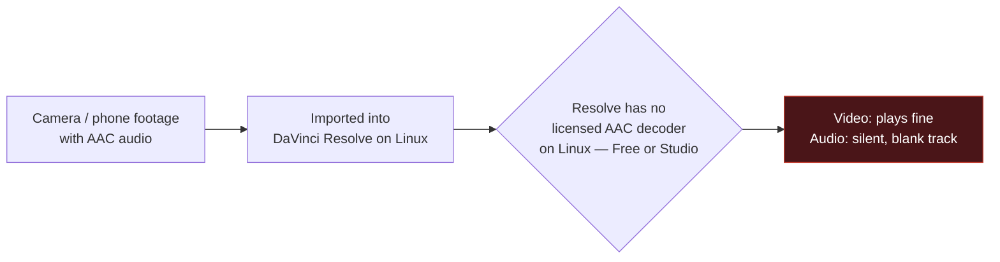

# DaVinci Resolve AAC Audio Fix

Fixes a specific, well-known DaVinci Resolve bug on Linux: import a video with
AAC audio (most phone and camera footage) and the clip comes in with a
completely silent, blank audio track. The video's fine — the audio just never
gets decoded.

This installs a small background watcher that detects it and fixes it
automatically, in place, within a few seconds of import. No manual conversion,
no re-importing, no editing workflow changes.

[](https://github.com/broskisworld/davinci-resolve-aac-fix/actions/workflows/tests.yml)

**[→ davinci-aac-fix.0thdraft.com](https://davinci-aac-fix.0thdraft.com)** — same explanation, prettier page.

---

## The problem, in one picture



This isn't a corrupt file or a missing codec package you can `apt install`.
Apple and Microsoft privately licensed AAC decoding for macOS and Windows;
that license was never extended to Linux. So Resolve on Linux reads the
video track fine, creates an audio track — and silently produces nothing for
it. Every version, Free and Studio, as of this writing.

## The fix, in one picture


The watcher runs as a background service, independent of whether Resolve is
even open yet. Import a clip, keep working — by the time you scrub to it,
the audio's already fixed.

**In place** specifically means: no separate converted copy sitting in some
cache folder forever. The original file's audio stream is re-encoded to PCM
and swapped back into the same path — same filename, same location, just
correct audio. The video stream is never touched (stream-copied, not
re-encoded), so there's no quality loss and it's fast. The one real tradeoff:
this modifies your source file, not a copy — the original AAC-encoded audio
is gone once it's fixed, and the file gets a bit larger since PCM audio is
less compressed. If you need pristine untouched originals for something else,
back them up first.

---

## Install

### Option A — one file, no terminal

1. Download **[`DaVinci-Resolve-AAC-Fix-Installer.desktop`](DaVinci-Resolve-AAC-Fix-Installer.desktop)**.
2. Double-click it. The first time you run any downloaded executable, Linux
   requires one small trust step — right-click → **Allow Launching** (exact
   wording varies by desktop environment):

   

3. A short setup wizard walks you through the rest, including the one manual
   step below.

### Option B — terminal

```bash
curl -fsSL https://raw.githubusercontent.com/broskisworld/davinci-resolve-aac-fix/main/install.sh | bash
```

or clone the repo and run `./install.sh` directly.

### The one manual step (can't be automated)

Resolve's scripting API — what lets the watcher talk to Resolve at all — is
off by default and can only be switched on from inside Resolve itself:

**Preferences → search "scripting" → External scripting using → Local → Save**


The installer waits for this and confirms the connection live before it
finishes — you'll know immediately if it worked.

---

## Requirements

- Linux, with DaVinci Resolve installed at `/opt/resolve` (the standard location)
- systemd (`--user` session) — true for essentially every mainstream desktop distro
- `ffmpeg` / `ffprobe` — installed automatically if missing (asks first)

Both Free and Studio editions work — this only uses functionality present in
Free too.

## Usage

Nothing, day to day — import AAC clips normally and they're fixed within a
few seconds. A couple of commands if you want to check on it:

```bash
./install.sh --status       # is it connected, what's it fixed so far
./install.sh --uninstall    # removes the service and installed files
journalctl --user -u davinci-aac-fix.service -f   # live logs
```

## How it works

<details>
<summary>Technical details</summary>

- `resolve_aac_watch.py` connects to a running Resolve instance via
  Blackmagic's official `DaVinciResolveScript` API and polls the current
  project's Media Pool every few seconds.
- For each clip, it checks the actual audio codec with `ffprobe` (not
  Resolve's own clip metadata, which is exactly what's stale/wrong here).
- If it's AAC: `ffmpeg -c:v copy -c:a pcm_s16le` re-encodes just the audio
  into a temp file in the *same directory* as the source (same filesystem,
  so the final swap is an atomic rename), then replaces the original.
- `MediaPoolItem.ReplaceClip()` is called with that *same* path — confirmed
  live that this forces Resolve to re-read the file's metadata even though
  the path didn't change (`Audio Codec` flips from `AAC` to `Linear PCM` in
  Resolve's own clip properties), which is what actually clears the stale
  blank-audio state.
- Runs as a `systemd --user` service (`install.sh` also supports a
  zenity-driven GUI install flow with no terminal, auto-selected when
  launched with no controlling terminal — e.g. via the `.desktop` file).

There's no event hook for "clip imported" in Resolve's scripting API on
Linux (checked) — polling is the only mechanism available, hence the small
delay after import rather than instant.
</details>

## Development

```bash
python3 -m pytest tests/          # daemon logic + sync checks
./tests/test_install_cli.sh       # install.sh argument parsing etc.
```

`resolve_aac_watch.py` is the source of truth for the daemon. `install.sh`
embeds a copy of it (so it stays a single portable file with no sibling-file
dependency), and `DaVinci-Resolve-AAC-Fix-Installer.desktop` embeds a copy of
`install.sh` the same way. After editing the daemon:

```bash
./sync-daemon.sh                  # regenerates install.sh's embedded copy
./build-single-file-installer.sh  # regenerates the .desktop bundle
python3 -m pytest tests/          # confirms all three are back in sync
```

CI (`.github/workflows/tests.yml`) runs the full suite on every push.

## License

[MIT](LICENSE)
