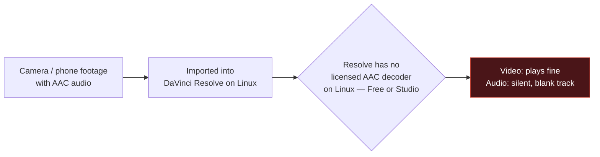
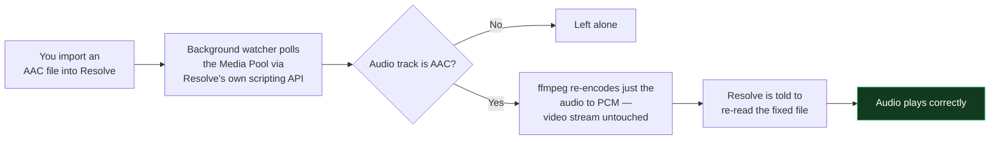

# DaVinci AAC Support

Fixes a DaVinci Resolve bug on Linux: import a video with AAC audio and the
clip comes in with a completely silent, blank audio track. Video's fine —
only the audio fails to decode.

This installs a background watcher that detects and fixes it automatically,
within a few seconds of import. No manual conversion, no re-importing.

[](https://github.com/broskisworld/davinci-aac-support/actions/workflows/tests.yml)

**[→ davinci-aac-support.0thdraft.com](https://davinci-aac-support.0thdraft.com)** — download and full walkthrough, prettier page.

---

## The problem



Not a corrupt file or a missing codec package. Apple and Microsoft privately
licensed AAC decoding for macOS and Windows; that license was never extended
to Linux. Every Resolve version, Free and Studio, as of this writing.

## The fix



Runs as a background service, independent of whether Resolve is even open.
Import a clip, keep working — it's fixed by the time you scrub to it. Video
is stream-copied, never re-encoded, so there's no quality loss. What happens
to the file itself — overwritten in place or written elsewhere, and whether
extra embedded streams survive — is configurable. See **Settings** below.

---

## Settings

Configurable from the dashboard's Settings card, or by editing
`~/.config/davinci-aac-support/config.json` directly. Changes apply on the
watcher's next poll — no restart needed.

**Conversion mode**

| Mode | Behavior | Tradeoff |
|---|---|---|
| **In place** (default) | Overwrites the original file. | No extra disk space. The original AAC audio is gone once fixed — permanently, no undo. |
| **Separate directory** | Writes the fixed copy to a folder you choose; the original file is never touched. | Uses extra disk space — a full copy per fixed clip. |

**Preserve extra streams** (off by default) — some camera files (drones,
action cams) carry a non-audio/video stream, usually an embedded timecode
track. ffmpeg's standard MP4 muxer can't write that stream back out at all —
confirmed directly: it fails even with nothing else being re-encoded. The
only way to keep it is switching to the QuickTime muxer instead, which
changes the output file's container brand (`mp4`/`isom` → `qt`, extension
unchanged). It opens the same everywhere, but it's a real identity change to
the file, not an internal flag — off by default for that reason. With this
off (default), that stream is dropped; video and audio are always kept
either way.

If you need a hard guarantee that nothing is ever lost, use **separate
directory** mode — the original file is untouched regardless of this setting.

---

## Install

**[→ davinci-aac-support.0thdraft.com](https://davinci-aac-support.0thdraft.com#install)** has the same downloads below, with screenshots.

### Option A — `.deb` (Debian, Ubuntu, Mint, and other apt-based distros)

1. Download **[`davinci-aac-support_1.0-1_all.deb`](davinci-aac-support_1.0-1_all.deb)** and install it (double-click, or `apt install ./davinci-aac-support_1.0-1_all.deb`).
2. Setup opens automatically right after install. If it doesn't, open **DaVinci AAC Support** from your applications menu — same setup.


Real package: shows up in your package manager, `apt remove davinci-aac-support` uninstalls cleanly.

### Option B — `.zip` (any other distro)

1. Download **[`davinci-aac-support.zip`](davinci-aac-support.zip)** and extract it.
2. Double-click **`davinci-aac-support.desktop`**. First run of any downloaded executable needs one confirmation — right-click → **Allow Launching**.


3. Same setup window opens. The launcher just runs `install.sh` next to it — open it in a text editor first if you want to see what it does.

### Option C — terminal

```bash
curl -fsSL https://raw.githubusercontent.com/broskisworld/davinci-aac-support/main/install.sh | bash
```

or clone the repo and run `./install.sh` directly.

### The one manual step

Resolve's scripting API is off by default — the watcher can't talk to Resolve without it:

**Preferences → search "scripting" → External scripting using → Local → Save**


The installer waits for this and confirms the connection live.

---

## Requirements

- Linux, DaVinci Resolve at `/opt/resolve` (standard location)
- systemd `--user` session — true on essentially every mainstream desktop distro
- `ffmpeg` / `ffprobe` — installed automatically if missing

Both Free and Studio work.

## Usage

Nothing, day to day. A couple ways to check on it:

```bash
davinci-aac-support-monitor   # live dashboard: connection status, settings,
                               # real-time detected/converting/fixed feed
./install.sh --status         # same info, plain text
./install.sh --uninstall      # removes the service and installed files
journalctl --user -u davinci-aac-support.service -f   # raw logs
```

## How it works

<details>
<summary>Technical details</summary>

- `davinci_aac_support_watch.py` connects via Blackmagic's `DaVinciResolveScript`
  API and polls the current project's Media Pool every few seconds (no import
  event hook exists on Linux — polling is the only option).
- Checks actual audio codec with `ffprobe`, not Resolve's own clip metadata
  (which is exactly what's stale here).
- If AAC: re-encodes audio to PCM (video stream-copied). Output location and
  whether extra streams are preserved follow `davinci_aac_support_config.py`
  — see Settings above.
- `MediaPoolItem.ReplaceClip()` is called with the fixed file's path —
  confirmed live this forces Resolve to re-read the file's metadata (`Audio
  Codec` flips from `AAC` to `Linear PCM`), clearing the stale blank-audio
  state, even when the path is unchanged.
- Runs as a `systemd --user` service. `install.sh` runs a GUI flow (local
  web server, opened as a chrome-less window via Chromium's `--app=` mode,
  falling back to a plain tab) when launched with no controlling terminal —
  e.g. via the `.desktop` file or the `.deb`'s postinst. No GUI-toolkit
  dependency (zenity/kdialog), since a browser doesn't care which desktop
  environment is installed.

</details>

## Development

```bash
python3 -m pytest tests/          # daemon + dashboard + config logic, artifact drift checks
./tests/test_install_cli.sh       # install.sh argument parsing etc.
```

All source files (`davinci_aac_support_watch.py`, `davinci_aac_support_ui.py`,
`davinci_aac_support_config.py`, `install.sh`) are plain, unencoded, and
un-generated. `davinci-aac-support.zip` and the `.deb` are the two generated
artifacts — rebuild after changing any packaged file:

```bash
./build-release-zip.sh && ./build-deb.sh
python3 -m pytest tests/          # confirms both artifacts match source
```

CI (`.github/workflows/tests.yml`) runs the full suite on every push, plus a
Fedora/Arch/Debian matrix that installs ffmpeg through each distro's real
package manager in a container (`docker/run-distro-tests.sh`, also runnable
locally). Caught a real bug this way: pacman needed a sync step it wasn't doing.

The dashboard screenshots above are regenerated in CI on every push to `main`
(`docker/capture-all-screenshots.sh`), built and captured from all three
distros as a visual-consistency check; only Debian's output is committed to
`docs/images/`, auto-committed by CI when it changes. Run locally the same way.

## License

[MIT](LICENSE)
