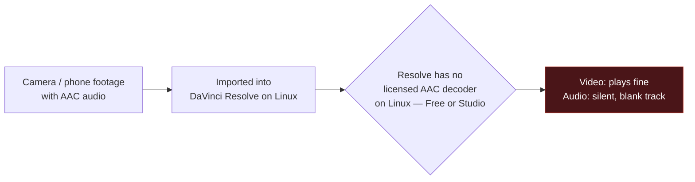
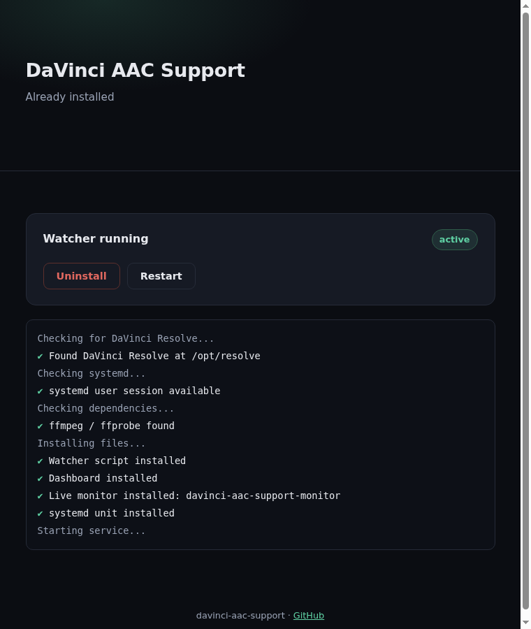
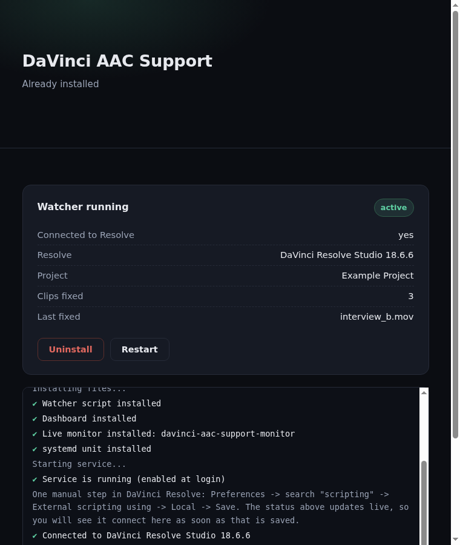
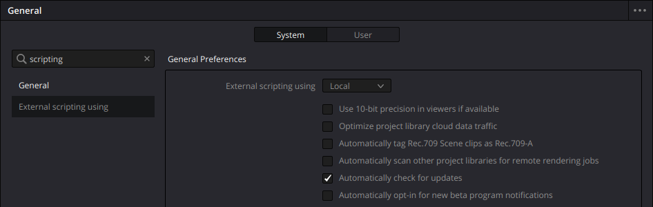

# DaVinci AAC Support

Fixes a specific, well-known DaVinci Resolve bug on Linux: import a video with
AAC audio (most phone and camera footage) and the clip comes in with a
completely silent, blank audio track. The video's fine — the audio just never
gets decoded.

This installs a small background watcher that detects it and fixes it
automatically, in place, within a few seconds of import. No manual conversion,
no re-importing, no editing workflow changes.

[](https://github.com/broskisworld/davinci-aac-support/actions/workflows/tests.yml)

**[→ davinci-aac-support.0thdraft.com](https://davinci-aac-support.0thdraft.com)** — same explanation, prettier page.

---

## The problem, in one picture



This isn't a corrupt file or a missing codec package you can `apt install`.
Apple and Microsoft privately licensed AAC decoding for macOS and Windows;
that license was never extended to Linux. So Resolve on Linux reads the
video track fine, creates an audio track — and silently produces nothing for
it. Every version, Free and Studio, as of this writing.

## The fix, in one picture


The watcher runs as a background service, independent of whether Resolve is
even open yet. Import a clip, keep working — by the time you scrub to it,
the audio's already fixed.

**In place** specifically means: no separate converted copy sitting in some
cache folder forever. The original file's audio stream is re-encoded to PCM
and swapped back into the same path — same filename, same location, just
correct audio. The video stream is never touched (stream-copied, not
re-encoded), so there's no quality loss and it's fast. The one real tradeoff:
this modifies your source file, not a copy — the original AAC-encoded audio
is gone once it's fixed, and the file gets a bit larger since PCM audio is
less compressed. If you need pristine untouched originals for something else,
back them up first.

---

## Install

### Option A — download, no terminal

1. Download **[`davinci-aac-support.zip`](davinci-aac-support.zip)** and extract it.
2. Double-click **`davinci-aac-support.desktop`** inside the extracted folder.
   The first time you run any downloaded executable, Linux requires one small
   trust step — right-click → **Allow Launching** (exact wording varies by
   desktop environment):

   

3. A dashboard opens in your browser and walks you through the rest,
   including the one manual step below — no terminal involved:

   
   

The launcher just runs `install.sh` from the same folder — open it in a text
editor first if you want to see exactly what it does before running it.

<sup>Both screenshots above are generated automatically, not hand-captured —
see [`docker/capture-all-screenshots.sh`](docker/capture-all-screenshots.sh)
in Development below.</sup>

### Option B — terminal

```bash
curl -fsSL https://raw.githubusercontent.com/broskisworld/davinci-aac-support/main/install.sh | bash
```

or clone the repo and run `./install.sh` directly.

### The one manual step (can't be automated)

Resolve's scripting API — what lets the watcher talk to Resolve at all — is
off by default and can only be switched on from inside Resolve itself:

**Preferences → search "scripting" → External scripting using → Local → Save**



The installer waits for this and confirms the connection live before it
finishes — you'll know immediately if it worked.

---

## Requirements

- Linux, with DaVinci Resolve installed at `/opt/resolve` (the standard location)
- systemd (`--user` session) — true for essentially every mainstream desktop distro
- `ffmpeg` / `ffprobe` — installed automatically if missing (asks first)

Both Free and Studio editions work — this only uses functionality present in
Free too.

## Usage

Nothing, day to day — import AAC clips normally and they're fixed within a
few seconds. A couple of ways to check on it:

```bash
davinci-aac-support-monitor   # opens the same dashboard, live: connection
                               # status, and a real-time feed as clips get
                               # detected / converted / fixed
./install.sh --status         # same info, plain text, for scripting
./install.sh --uninstall      # removes the service and installed files
journalctl --user -u davinci-aac-support.service -f   # raw logs
```

## How it works

<details>
<summary>Technical details</summary>

- `davinci_aac_support_watch.py` connects to a running Resolve instance via
  Blackmagic's official `DaVinciResolveScript` API and polls the current
  project's Media Pool every few seconds.
- For each clip, it checks the actual audio codec with `ffprobe` (not
  Resolve's own clip metadata, which is exactly what's stale/wrong here).
- If it's AAC: `ffmpeg -c:v copy -c:a pcm_s16le` re-encodes just the audio
  into a temp file in the *same directory* as the source (same filesystem,
  so the final swap is an atomic rename), then replaces the original.
- `MediaPoolItem.ReplaceClip()` is called with that *same* path — confirmed
  live that this forces Resolve to re-read the file's metadata even though
  the path didn't change (`Audio Codec` flips from `AAC` to `Linear PCM` in
  Resolve's own clip properties), which is what actually clears the stale
  blank-audio state.
- Runs as a `systemd --user` service. `install.sh` auto-selects a GUI flow
  when launched with no controlling terminal (e.g. via the `.desktop` file):
  it starts `davinci_aac_support_ui.py`, a small local web server (Python
  stdlib only, no GUI-toolkit dependency), and opens it in the default
  browser. The daemon separately emits structured events (clip detected /
  converting / fixed) to a small JSONL file that both the install dashboard
  and the standalone `davinci-aac-support-monitor` command tail live via
  Server-Sent Events.

There's no event hook for "clip imported" in Resolve's scripting API on
Linux (checked) — polling is the only mechanism available, hence the small
delay after import rather than instant.

**Why a local web page instead of a native GUI toolkit:** the installer used
to drive `zenity` dialogs. Those look generic, and — more importantly —
`zenity` isn't installed everywhere; KDE/Plasma ships `kdialog` instead, so a
`zenity`-only GUI silently fails to nothing on non-GNOME desktops (no
terminal attached to show the fallback text either). A browser doesn't care
which desktop environment or toolkit is installed, so this sidesteps that
entirely while also allowing an actual designed interface instead of stock
dialog boxes.

**Why a zip instead of one embedded file:** an even earlier version packed
everything into a single `.desktop` file with the installer base64-encoded
into its `Exec=` line, so it'd be one downloadable file. That's unreadable at
a glance, which matters for something that runs on your machine — so
`install.sh` ships as a plain, readable script, with the daemon and dashboard
as ordinary sibling files next to it (not embedded). The `.desktop` launcher
just calls `install.sh`, in the clear.
</details>

## Development

```bash
python3 -m pytest tests/          # daemon + dashboard logic, zip contents check
./tests/test_install_cli.sh       # install.sh argument parsing etc.
```

`davinci_aac_support_watch.py`, `davinci_aac_support_ui.py`, and `install.sh`
are all plain source files — nothing is generated or embedded between them.
`davinci-aac-support.zip` is
the one generated artifact (see `build-release-zip.sh`); rebuild it after
changing any packaged file:

```bash
./build-release-zip.sh
python3 -m pytest tests/          # confirms the zip matches the source files
```

CI (`.github/workflows/tests.yml`) runs the full suite on every push, plus a
Fedora/Arch/Debian matrix that actually installs ffmpeg through each distro's
real package manager in a container (`docker/run-distro-tests.sh` — also
runnable locally, `./docker/run-distro-tests.sh` or with specific distros
as args). Not just read-and-assume: this caught a real bug where the pacman
branch needed a sync step it wasn't doing.

The two dashboard screenshots above are also regenerated in CI on every push
to `main` (`docker/capture-all-screenshots.sh` drives the real, unmodified
`install.sh` through a faked-but-representative install in a container and
screenshots it — see the script for exactly what's faked and why). It builds
and captures from all three distros as a visual-consistency check, uploads
all three as workflow artifacts, but only Debian's output is what's actually
committed to `docs/images/` — CI auto-commits that pair of files back to
`main` when they change, so the README can't drift out of sync with what the
dashboard actually looks like. Run it locally the same way:
`./docker/capture-all-screenshots.sh`.

## License

[MIT](LICENSE)
